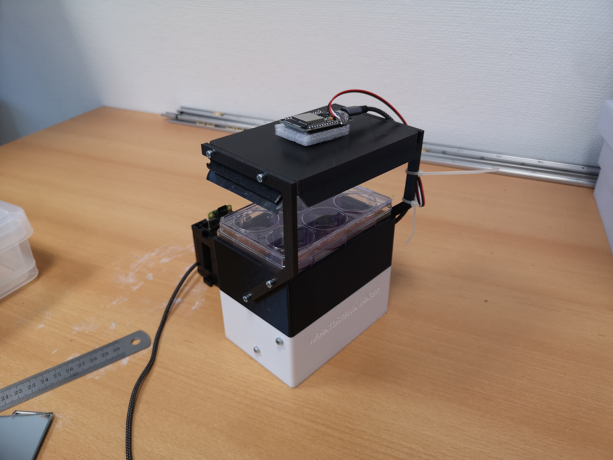
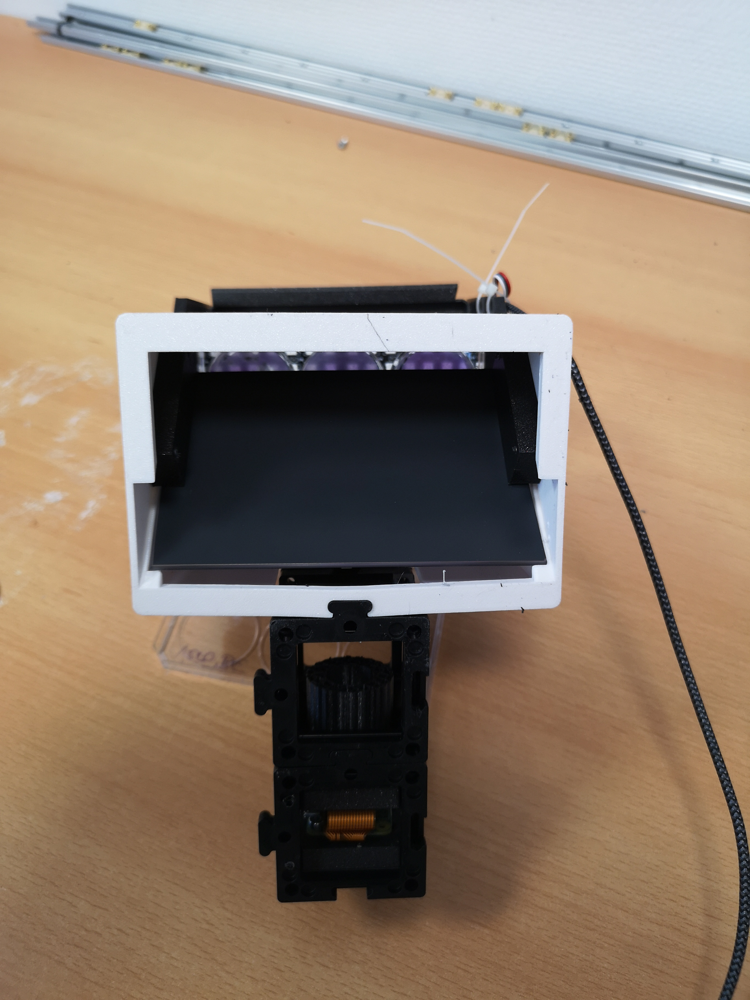

# Wellplate Imager 

This is the repository to help you build a small device that captures a wellplate in one shot. 

Features:
- Brighfield or Darkfield illumination
- Monochrome or RGB CCTV Camera for raw-data readout
- Timelapse imaging
- Analysis inside ImSwitch or Napari
- Simple to setup
- Compact design due to folding mirror
- Fov ~130x90mm
- Resolution ~50-100µm

### Bill of Material

| Item | Description | Price (approx.) | Link |
|------|-------------|-----------------|------|
| Camera | HIK MV-CE060-10UM with IMX178 Chip | €200 | [HIK Robotics](https://www.hikrobotics.com/en/machinevision/visionproduct?typeId=40&id=49&pageNumber=1&pageSize=50) |
| USB 3 Camera Cable | - | €15 | [Amazon](https://www.amazon.com) |
| Zoom Lens | 8-50mm Zoom Lens, C-Mount | €40 | [BerryBase](https://www.berrybase.de/8-50mm-zoom-objektiv-c-mount?number=CLENS-8Z50&utm_source=google&utm_medium=cpc&gad_source=1&gclid=Cj0KCQjw2a6wBhCVARIsABPeH1vZhG0LMiEijXiLjm8ePEX9mGRxWXGQy9iU88cnWSKoqkpaHCx1nz8aAk7yEALw_wcB) |
| Mirror | - | €10 | [Amazon DE](https://www.amazon.de/tyi-Spiegelfliesen-Selbstklebend-Acrylspiegel-Klebespiegel/dp/B0C3HD7PRF/ref=asc_df_B0C3HD7PRF/?tag=googshopde-21&linkCode=df0&hvadid=658741313887&hvpos=&hvnetw=g&hvrand=15587075228519062594&hvpone=&hvptwo=&hvqmt=&hvdev=c&hvdvcmdl=&hvlocint=&hvlocphy=9068538&hvtargid=pla-2199988077785&psc=1&mcid=9608ba37e61138fa97c54c4790eef9bb&th=1&psc=1) |
| ESP32 | - | €7 | [BerryBase](https://www.berrybase.de/esp32-nodemcu-development-board) |
| Neopixel Array / Strip | - | €5 | [eBay DE](https://www.ebay.de/itm/284704575743?chn=ps&_ul=DE&var=586375991445&norover=1&mkevt=1&mkrid=707-134425-41852-0&mkcid=2&mkscid=101&itemid=586375991445_284704575743&targetid=1404115578893&device=c&mktype=pla&googleloc=9068538&poi=&campaignid=17935704717&mkgroupid=139162549385&rlsatarget=pla-1404115578893&abcId=9301059&merchantid=494568270&gad_source=1&gclid=Cj0KCQjw2a6wBhCVARIsABPeH1tvd5_6E7g87w03x6WPOlgBgZsf5hDU5wxcSEtAXB7yAphJJcjHBpEaAsu9EALw_wcB) |

### 3D Printing Files

| Part | File Name |
|------|-----------|
| Base | Basefile.stl |
| Lid | Lidfile.stl |

### Assembly Guide

**Step 1:** *(Instructions to be added)*

**Step 2:** *(Instructions to be added)*

### ImSwitch Configuration

*Comming Soon*

## Showcase

 ## ImSwitch Configuration

 Comming Soon 

 ## License

Hardware is licensed under the CERN OHL. 
